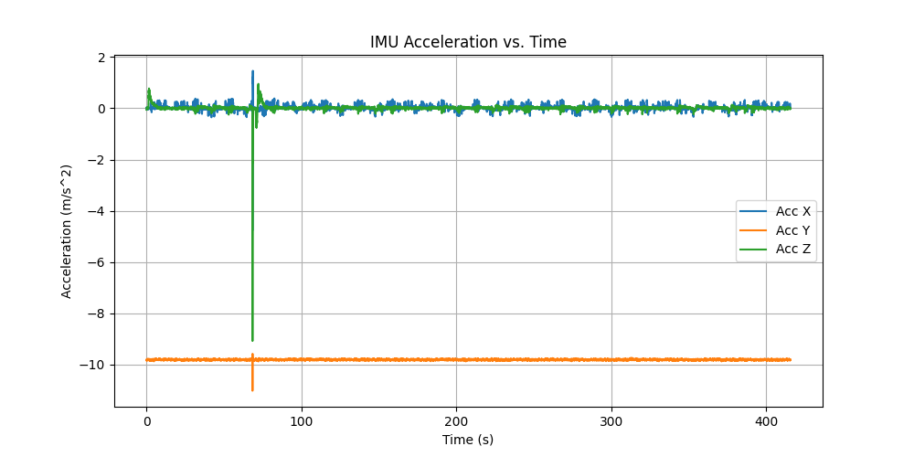
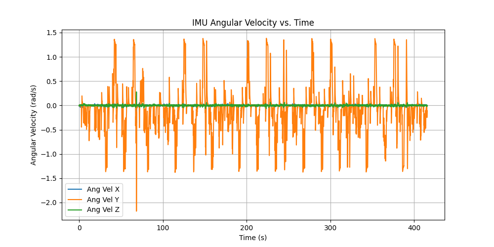
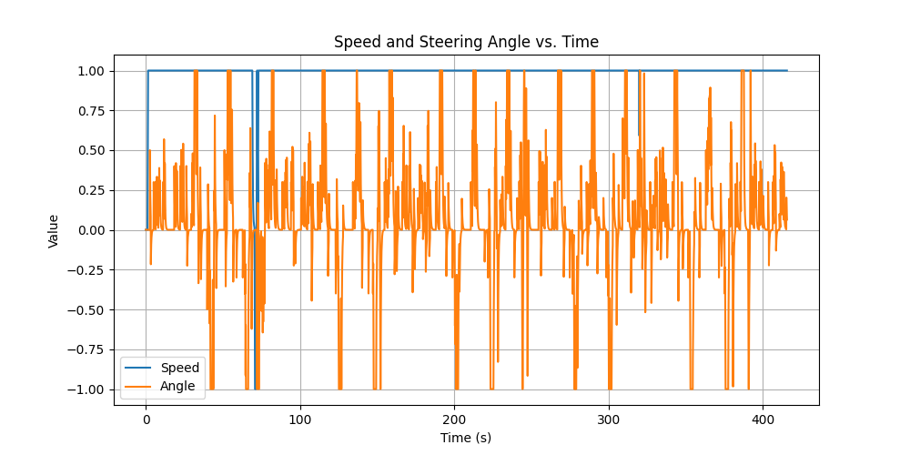
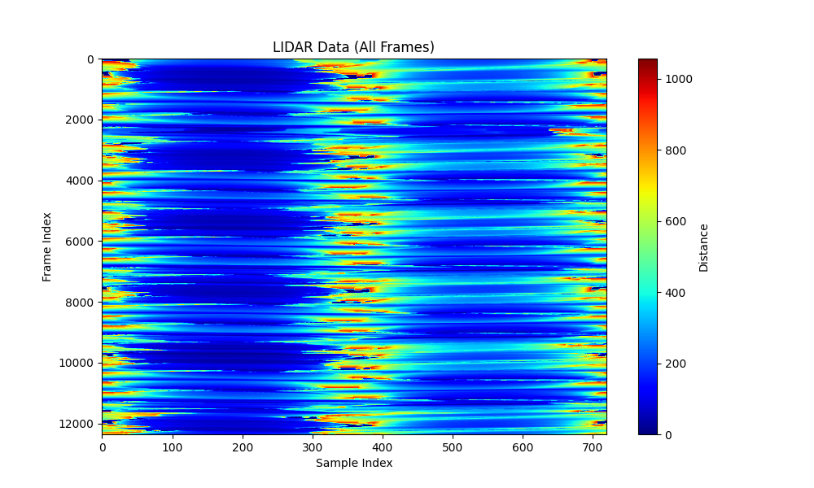

# racecar ml

## install

Just clone the repo next to the ```/labs``` folder in the ```racecar-student``` folder.

You might also need to install some dependencies into the racecar env:

```bash
pip3 install scikit-learn
```

## Overview

This repo contains code related to immitation learning for the racecar project. The goal is to train a ML model to drive a racecar around a track. The model is trained using data collected from a human driver. 

## Data Collection

The data collection is done using the ```save_data.py``` script.
This script saves the data into a csv file. You have to drive around the track to collect data.

You can use the ```playback.py``` script to visualize the data.

here are some of the outputs:









## fit a simple model

The model is trained using the ```regTree.py``` notebook.

### current model

The current model is a simple Gradient Boosting Regressor. The model is trained to predict the steering angle based on the lidar data alone.
At the moment we only use one frame of lidar data at a time.

## test the model

The model is tested using the ```racecar sim GB.py``` script.